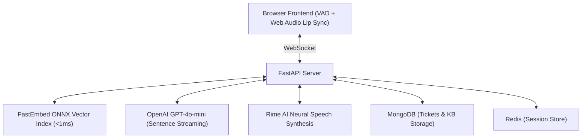

# 🎙️ VoxAssist — Real-Time Voice IT Helpdesk Agent

VoxAssist is an ultra-low-latency, voice-first AI Helpdesk Assistant built for enterprise IT support. It combines local ONNX vector embeddings, sentence-pipelined LLM generation, and neural speech synthesis to deliver spoken IT troubleshooting in under 2 seconds.

---

## ✨ Key Features

- ⚡ **Sub-2.0s Voice Latency**: Sentence-pipelined streaming for fast Time-To-First-Audio (TTFA).
- ⚡ **Zero-Latency Barge-In Interruption**: Instantly cancels active TTS streams when the user interrupts mid-sentence.
- 🧠 **FastEmbed ONNX RAG**: Sub-1ms local vector search across 20 enterprise IT topics (`BAAI/bge-small-en-v1.5`).
- 💾 **In-Memory Write-Through Session Store**: Zero-delay local state updates with background Redis persistence.
- 💤 **Step-by-Step Sleep Mode**: Auto-sleeps after instructions; wakes up on voice command (*"I applied that"*) or timer.
- ⏱️ **Inactivity Watchdog**: 25s check-in ("Are you still there?") and 50s auto-pause session termination.
- 👄 **Real-Time Waveform Lip Sync**: Web Audio API loudness tracking drives SVG mouth animations frame-by-frame.
- 🎫 **Automated IT Escalation**: Creates structured escalation tickets in MongoDB when troubleshooting fails.
- 🌐 **Multi-Language Support**: Seamless English & Hindi voice and text understanding.
- 🧪 **Automated Pytest Suite**: Async unit & integration tests (`pytest tests/`) covering REST endpoints, FastEmbed ONNX RAG, session store, and WebSocket streams.

---

## 🏗️ System Architecture



---

## 🚀 Quickstart

### 1. Setup Environment

```bash
git clone https://github.com/RajaThapak/VoxAssist.git
cd VoxAssist

python -m venv venv
# Activate virtualenv (Windows):
.\venv\Scripts\activate

pip install -r requirements.txt
```

### 2. Configure Environment Variables (`.env`)

```env
PORT=8000
HOST=0.0.0.0

OPENAI_API_KEY=your_openai_api_key
RIME_API_KEY=your_rime_api_key

REDIS_URL=redis://localhost:6379
MONGO_URI=mongodb://localhost:27017

QDRANT_URL=https://your-qdrant-cluster.qdrant.tech:6333
QDRANT_API_KEY=your_qdrant_api_key
```

### 3. Run Server & Run Tests

```bash
# Start backend server:
python -m backend.main

# In another terminal, run pytest test suite:
python -m pytest tests/ -v
```

Access the application at **http://localhost:8000**.
